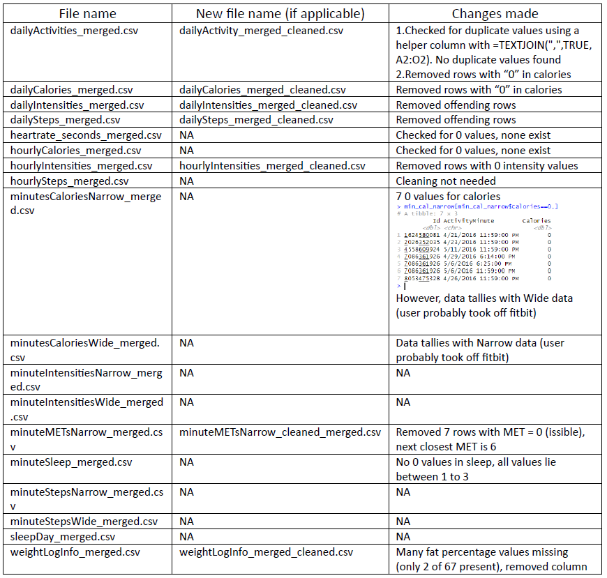

```{r setup, include=FALSE}
knitr::opts_chunk$set(echo = TRUE)
```

```{r libraries, include = FALSE}
library(tidyverse)
library(readr)
library(knitr)
```

## Contextual information of the case study

Bellabeat is a high-tech manufacturer of health-focused products for women. The task given was to focus on one of Bellabeat's products, and analyze smart device data to gain insight into how consumers are using their smart devices. The insights discovered will then help guide marketing strategy for the company. 


##  'Ask' Phase

As of late, more people have been using smart devices such as smart watches and voice controlled assistants. As quoted from Deloitte: "There has been a clear trend towards greater daily use of both health monitoring and home devices since the beginning of the pandemic. The trends are particularly strong for smartwatches, fitness bands and voice-assisted speakers."

With respect to Bellabeat customers, this means that products such as Leaf (Bellabeat's wellness tracker in the form of a bracelet, necklace or clip) and Time (Bellabeat's wellness watch) could be more heavily promoted to ride on this trend and increase sales. It is obvious that the company can afford to focus on these products' marketing more aggressively as compared to other products. 

As such, the goal now is to **analyse existing available consumer data, then create a more informed and tailored marketing strategy for Bellabeat**. The steps taken will be documented herein. 


## 'Prepare' Phase

To tackle the current task, a list of .csv files was given. 

(file names of cleaned files may be included)

```{r list_of_files}
list.files(path=".", pattern=NULL, all.files=FALSE,
    full.names=FALSE)
```
The data is all organised by user ID. 

There are some issues with the data provided, such as: 

* Data is somewhat biased, not all IDs submitted data equally (for example, in sleepDay only 24 out of 30 users submitted data at all)
* Not everybody used the health tracker at all times, and some users have incorrect data such as 0 steps recorded for multiple days. These outliers have to be removed at a later stage.

Regardless, the data provided is able to help us answer our questions, as it can help us discover the habits of users of health trackers, especially the habits of those who use the trackers on a regular basis. 


## 'Process' Phase

Each .csv file given to me was processed, and changes were recorded (if made).

To start off, we removed invalid data that indicated no use of the health tracker. This was determined by a '0' value in the csv files. The below example denotes the steps taken using the 'daily_activity' csv file.  

```{r removing_outliers_1_read, include = FALSE}
daily_activity <- read_csv("dailyActivity_merged.csv")
```

```{r removing_outliers_1}
daily_activity[daily_activity$Calories==0,]
```

We searched for '0' values in the Calories column, as it is impossible that a human burns 0 calories in a day. We were then able to identify that these IDs are contributing incorrect data that will skew our data towards outliers (0). These rows of data were manually removed using Excel, and the cleaned data was then put in the same folder (dailyActivity_merged_cleaned.csv). 

We also look out for these IDs in case they cause problems in other .csv files. An example of a check done is displayed below.

```{r removing_outliers_2_read, include = FALSE}
hr_sec <- read_csv("heartrate_seconds_merged.csv")
```

```{r removing_outliers_2}
colSums(hr_sec==0)
# manually checking for records of each offending ID
hr_sec[hr_sec$Id==1503960366,]
hr_sec[hr_sec$Id==6290855005,]
hr_sec[hr_sec$Id==8253242879,]
hr_sec[hr_sec$Id==8583815059,]
```

We also checked for duplicate values using Excel in each .csv file. This was done using a helper column with the formula similar to this: *=TEXTJOIN(",",TRUE, A2:O2)*.There were no duplicate values found in any of the sheets.

Another change I made was regarding the 'minuteMETsNarrow_merged.csv' file. According to healthline.com, "*A MET is a ratio of your working metabolic rate relative to your resting metabolic rate. Metabolic rate is the rate of energy expended per unit of time. It’s one way to describe the intensity of an exercise or activity.*" Since it is physically not possible for one's metabolic rate to be 0, it is **impossible for the value of MET to be 0**.

```{r removing_outliers_3_read, include=FALSE}
min_met_narrow <- read_csv("minuteMETsNarrow_merged.csv")
```

```{r removing_outliers_3}
min_met_narrow[min_met_narrow$METs==0,]
min_met_narrow_clean <- min_met_narrow[min_met_narrow$METs!=0,]
write.csv(min_met_narrow_clean, "minuteMETsNarrow_merged_cleaned.csv", row.names=FALSE)
```

The rows where MET = 0 were removed, and the result was saved in a cleaned csv file. 

The last check i performed was on the 'weightLogInfo_merged.csv' file. Upon initial inspection, there were many missing values in the Fat column.

```{r removing_outliers_4_read, include=FALSE}
weight_log <- read_csv("weightLogInfo_merged.csv")
```

```{r removing_outliers_4}
subset(weight_log, is.na(Fat))
```

There was a total of 65 rows with the value of Fat missing. I opted to remove the entire column directly using Excel.

Below is a summary of all the changes made to the files provided.

```{r changes_made, echo=FALSE, fig.cap="Changes made", out.width = '50%'}

```

## 'Analyse' Phase

I set out to explore relevant trends that could assist in Bellabeat's marketing strategy. With the data available, the trends i looked into were:

* Intensity of activity of consistent health tracker users 
* Time of day vs Calories burnt 
* Time in bed vs Quality of sleep

#### Intensity of activity of consistent health tracker users

```{r graph_1_identifier, echo=FALSE}
# introduce a new column for identifier, categorising rows based on the relative proportions of intensity within the activity
daily_activity <- daily_activity %>%
  mutate(identifier = case_when(
    VeryActiveDistance >= ModeratelyActiveDistance & VeryActiveDistance >= LightActiveDistance ~ "Very Active",
    ModeratelyActiveDistance >= VeryActiveDistance & ModeratelyActiveDistance >= LightActiveDistance ~ "Moderately Active",
    TRUE ~ "Light Active"  # LightActiveDistance has the highest value or equal to other distances
  ))
```

```{r graph_1, echo=FALSE}
bar_colors <- c("#1f78b4", "#33a02c", "#e31a1c")
ggplot(daily_activity, aes(x = identifier)) + 
  geom_bar(fill = bar_colors) +
  labs(title = "Daily Activity",
       x = "Intensity",
       y = "Count") +
  theme_minimal()
```

We categorized the different activities recorded into 'Light Active', 'Moderately Active', and 'Very Active' depending on the greatest portion of intensity recorded in the spreadsheet. Above, we can tell that Fitbit users usually clock in light activities, as compared to moderate and highly active activities.

#### Time of day vs Calories burnt

```{r graph_2_read, include=FALSE}
hourly_calories <- read_csv("hourlyCalories_merged.csv")
```

```{r graph_2_calculations, echo=FALSE}
# properly convert strings into datetime format
hourly_calories$DateTime <- as.POSIXct(hourly_calories$ActivityHour,format="%m/%d/%Y %I:%M:%S %p", tz=Sys.timezone())
hourly_calories$Time <- format(as.POSIXct(hourly_calories$DateTime), format="%H:%M:%S")

# include new column to find average calories burnt per hour of day
hourly_calories <- hourly_calories %>%
  group_by(Time) %>%
  mutate(average_calories_burnt = mean(Calories))
```

```{r graph_2, echo=FALSE}
ggplot(hourly_calories, aes(x = Time, y = average_calories_burnt, group = 1)) +
  geom_line(color = "blue") +
  geom_point(color = "blue") +
  scale_x_discrete(guide = guide_axis(angle = 90)) +
  annotate("rect", fill = "orange", alpha = 0.5, ymin = -Inf, ymax = Inf, xmin = 13, xmax = 20) +
  labs(title = "Average Calories Burnt during Time of Day",
       x = "Time of Day",
       y = "Average Calories Burnt") 
```

We calculated the average calories burnt after categorizing the data rows into their respective hours of day. Consequently we are able to observe the graph above, and we can observe the peak time period when people happen to burn the most calories. 

#### Time in bed vs Quality of sleep

```{r graph_3_read, include=FALSE}
sleep_day <- read_csv("sleepDay_merged.csv")
sleep_day <- sleep_day %>%
  mutate(time_ratio = TotalMinutesAsleep / TotalTimeInBed)
View(sleep_day)
```

```{r graph_3, echo=FALSE, message=FALSE}
line_color <- "#1f78b4"
point_color <- "#33a02c"
ggplot(sleep_day, aes(x = TotalTimeInBed, y = time_ratio)) + 
  geom_smooth(se = FALSE, color = line_color) +
  geom_jitter(color = point_color) +
  labs(title = "Sleep Analysis",
       x = "Total Time In Bed (minutes)",
       y = "Time asleep (%)") +
  theme_minimal()
```

Using the 'sleepDay_merged.csv' file, we were able to gather some basic statistics about the quality of sleep people get. We can observe 2 main trends: 

* Time asleep (%), and subsequently sleep quality, decreases over time after roughly 625 minutes asleep (10.4 hours), so it is best to maintain less than that amount of sleep
* There are multiple outliers within the 250-625 minute range with lower time asleep (%) and hence lower sleep quality.

## 'Share' Phase

The relevant conclusions we have drawn, and the recommendations we have prepared will be stated below.

* Health tracker users focus mainly on light intensity activities such as walking, as compared to moderate and high intensity activities.
  + Introduce more low intensity activities to increase user retention. Examples include National Steps Challenge from Singapore, which encourages Singaporeans to take at least 10,000 steps per day.
* People tend to burn more calories in the later part of the day (12pm to 8pm). 
  + Introduce more time-limited activities with attractive rewards, to attract people to choose Bellabeat's activities and programmes over other forms of activity during that time period.
* There are diminishing returns to sleeping more (past 10 hours), as well as a general trend of poor sleep quality.
  + Focus on marketing efforts targeting people with poor amounts of sleep and sleep quality, and let the app give more insights as to how users can improve their sleep quality over time.